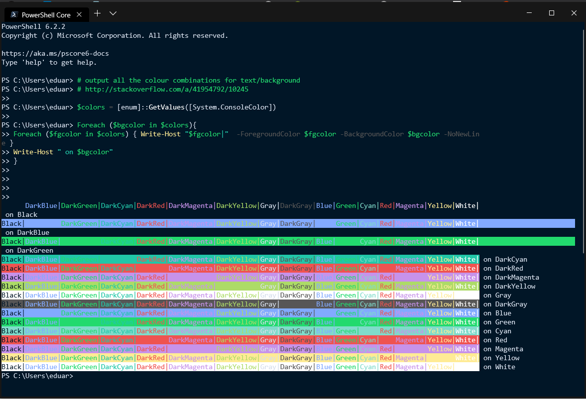
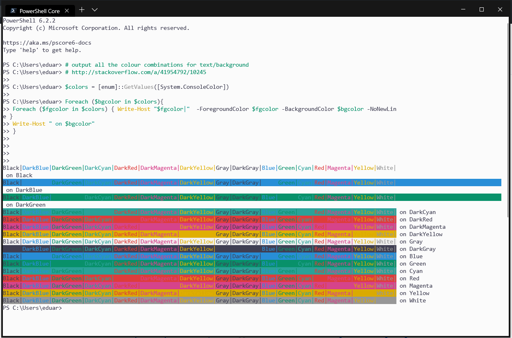
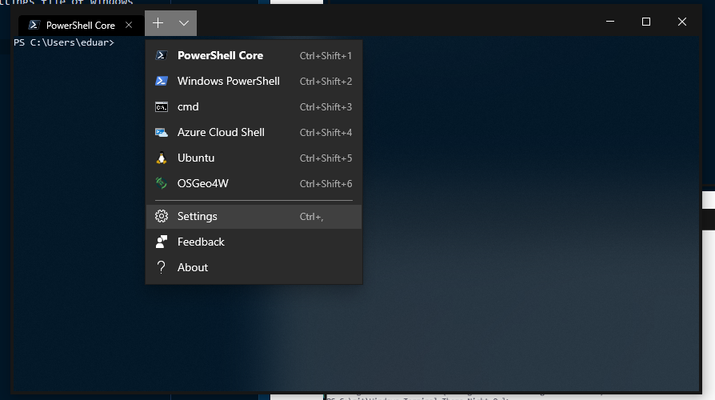
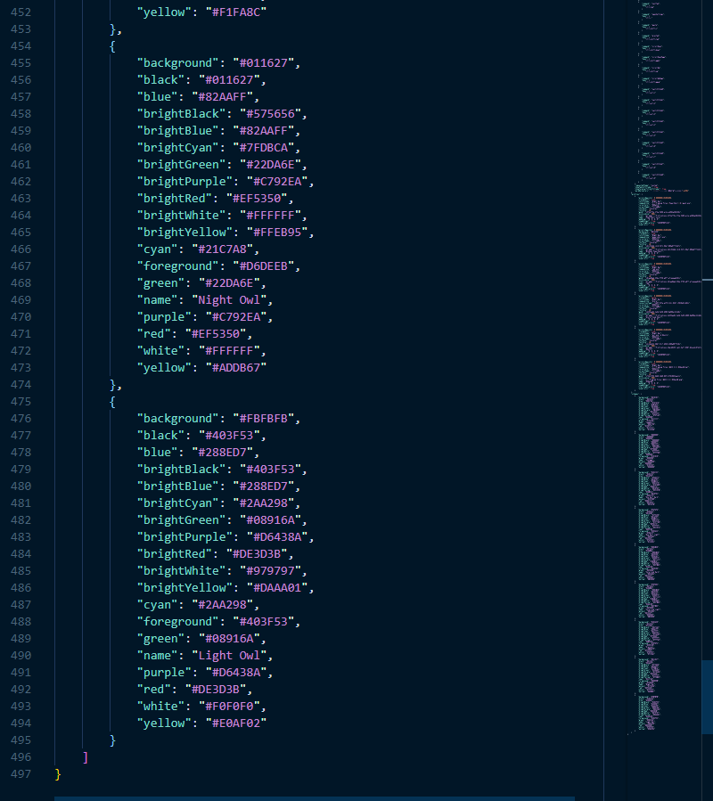
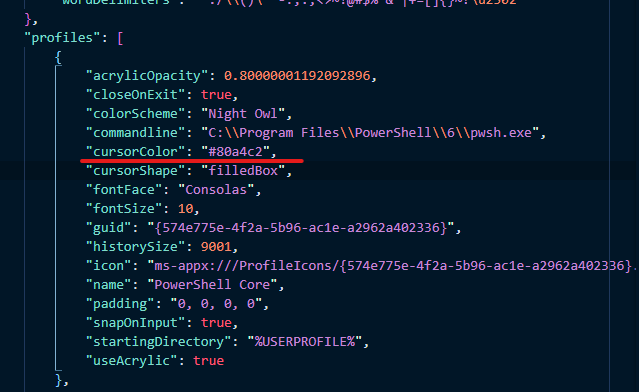

# Windows Terminal Theme Night Owl

Color schemes inspired by the Night Owl theme for VS Code by Sarah Drasner

[Sarah Drasner Night Owl](https://github.com/sdras/night-owl-vscode-theme)

Night Theme

Light Theme

I need to make adjustments to the light theme because the terminal use white 
for numbers so with the original color it doesn´t look good.

## How use

Just copy the content in de JSON file to the JSON settings file of windows 
terminal

### Note:

I provide the JSON files for you can copy and paste see the [schemes.json](schemes.json) file in the root directory! :)

I recommend not using the acrylic feature or using it with a 8+ value

## Cursor colors

1. for night theme: #80A4C2
2. for light theme: #90A7B2

## License

[MIT License](LICENSE.md)
