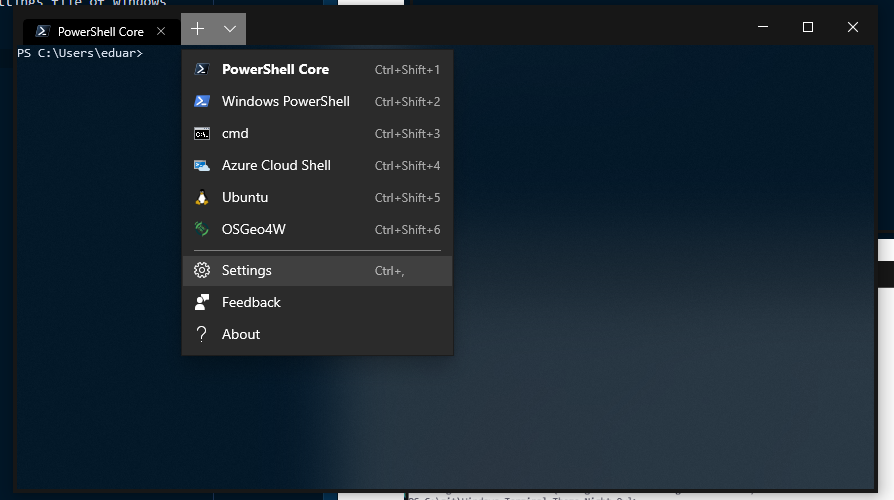
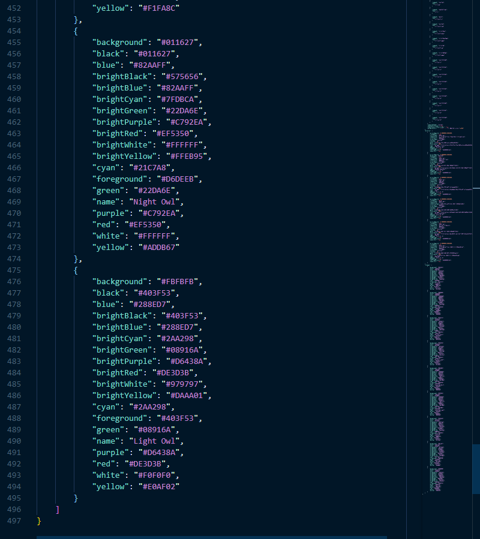
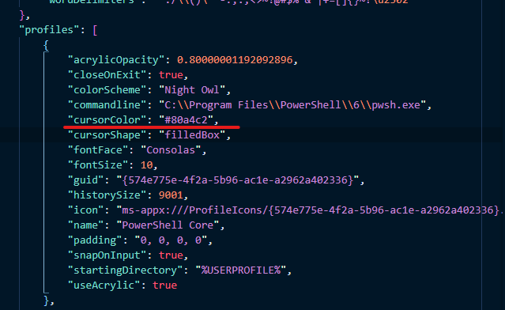

# Windows Terminal Theme Night Owl

Color schemes inspired by the Night Owl theme for VS Code by Sarah Drasner

## How use

Just copy the content in de JSON file to the JSON settings file of windows 
terminal

I recommend not using the acrylic feature or using it with a 8+ value

## Cursor colors 

1. for night theme: #80a4c2
2. for light theme: #90A7B2

